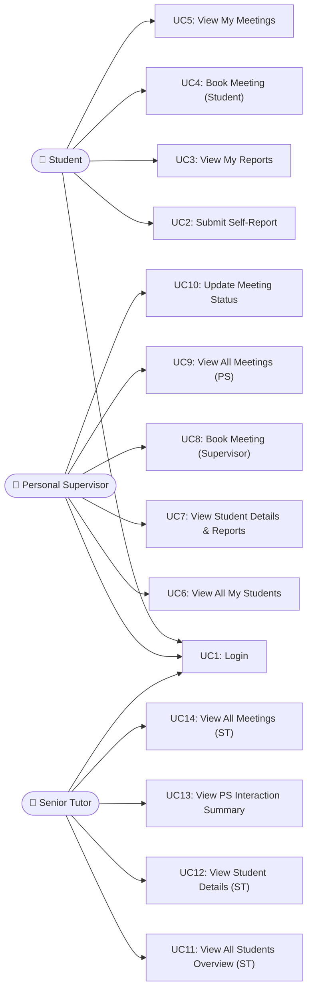
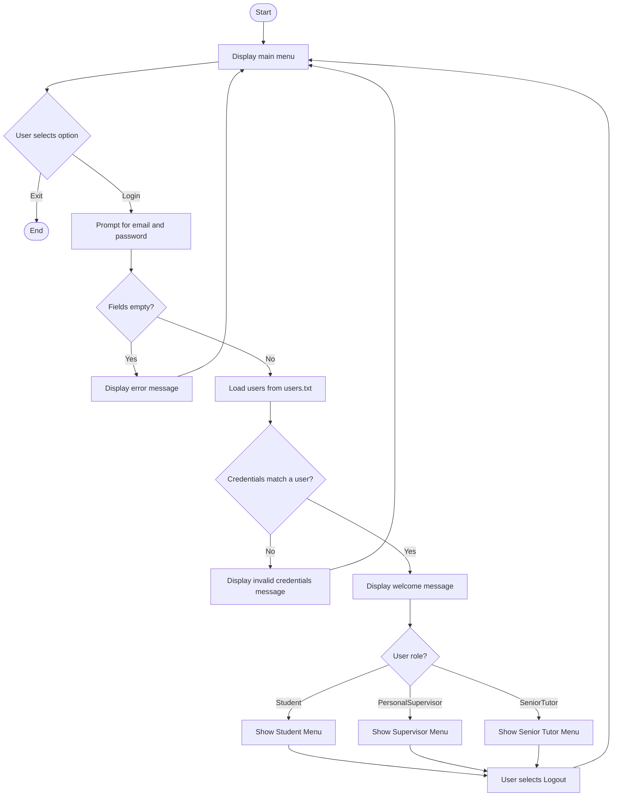
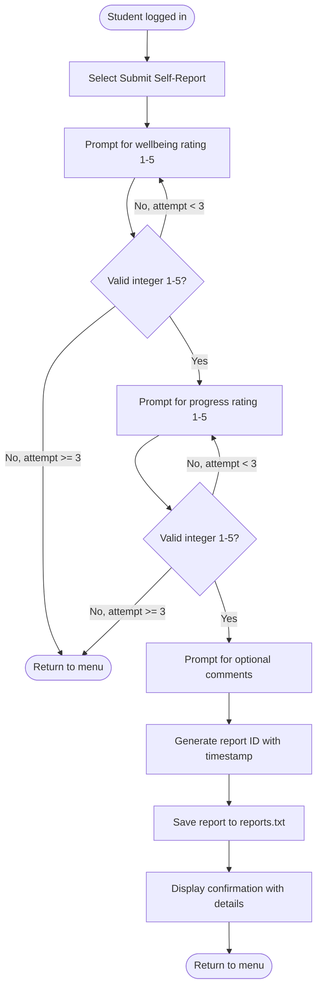
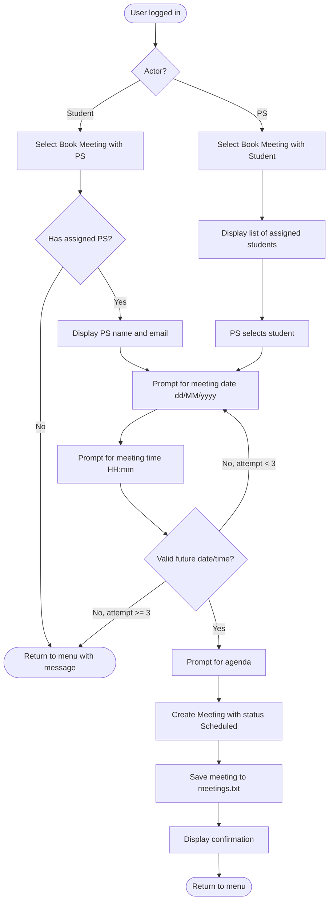
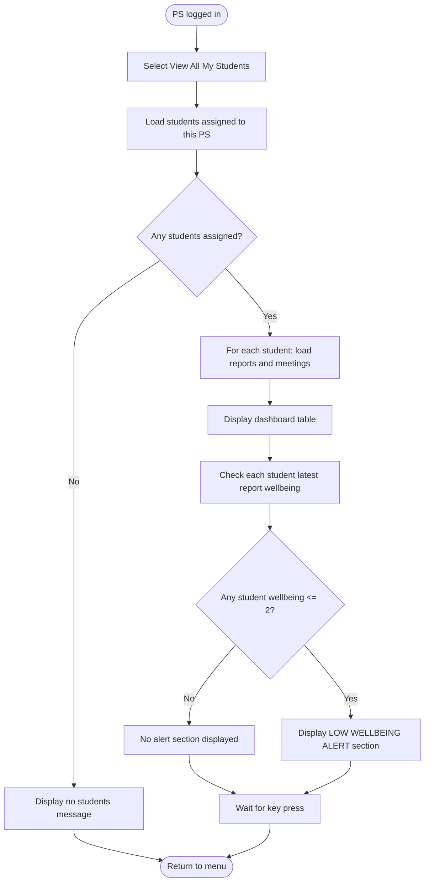
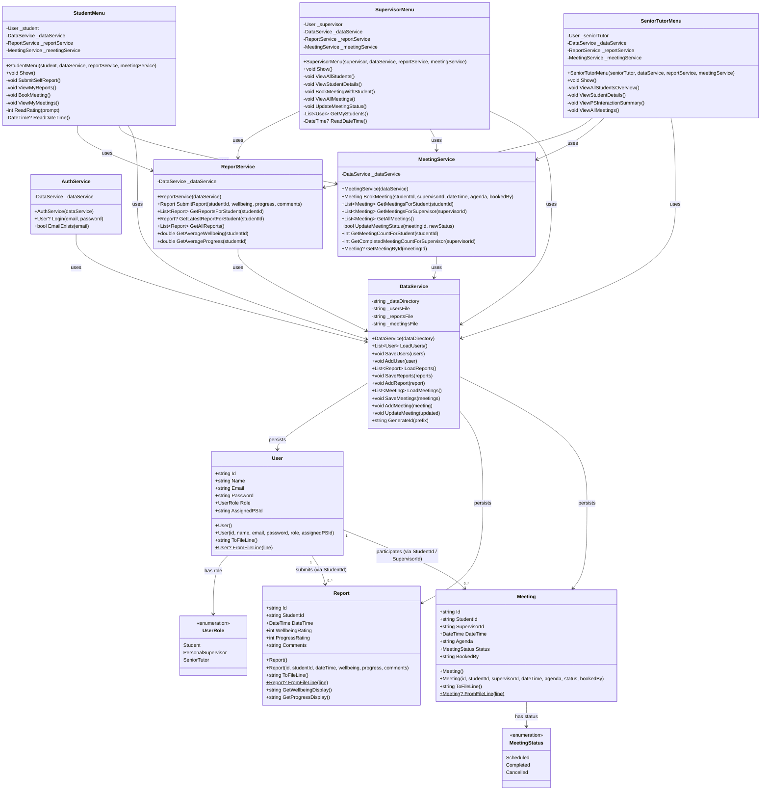
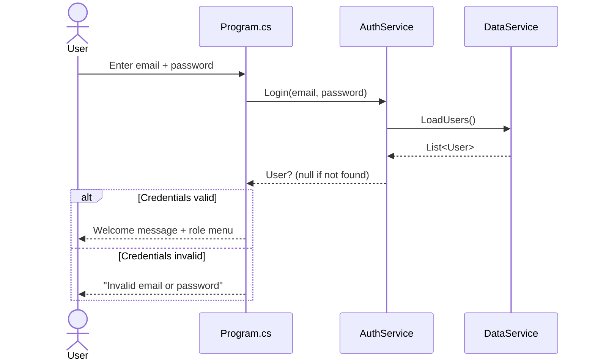
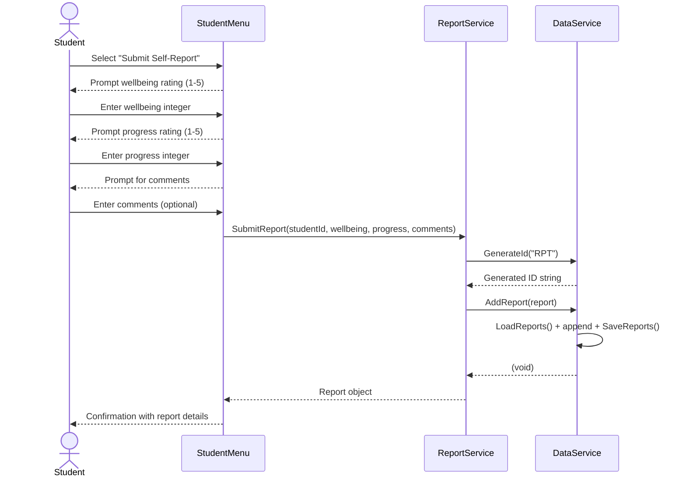
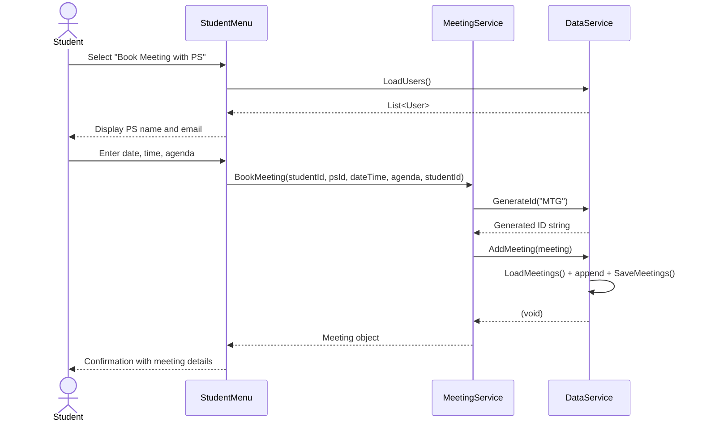
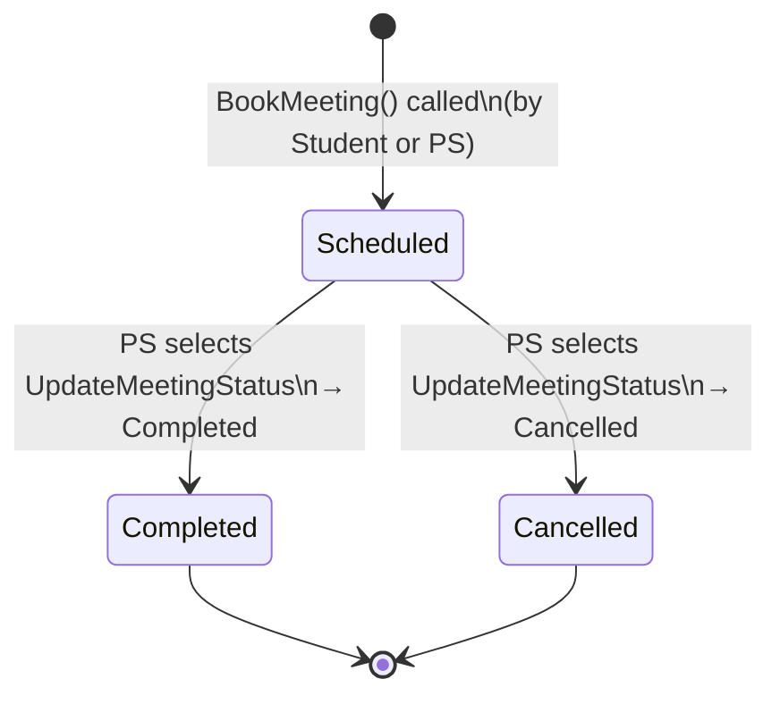

# Individual Software Project Portfolio Report
## Personal Supervisor System

---

## Table of Contents

1. [Introduction](#1-introduction)
2. [Overall Description](#2-overall-description)
3. [Requirements Modelling](#3-requirements-modelling)
   - [3.1 Personas](#31-personas)
   - [3.2 Scenarios](#32-scenarios)
   - [3.3 Use Cases](#33-use-cases-templated-scenarios--diagrams)
   - [3.4 Activity Diagrams](#34-activity-diagrams)
   - [3.5 Requirements](#35-requirements)
   - [3.6 Test Plans + Traceability Matrix](#36-test-plans--traceability-matrix)
4. [Design](#4-design)
   - [4.1 Class Modelling](#41-class-modelling)
   - [4.2 Sequence and State Diagrams](#42-sequence-and-state-diagrams)
5. [Implementation](#5-implementation)
   - [5.1 Link to GIT Repo](#51-link-to-git-repo)
   - [5.2 Implementation Aspects](#52-brief-documentation-of-implementation-aspects)
   - [5.3 Automated Test Plan](#53-evidence-of-automated-test-plan)
   - [5.4 Automated Build Pipeline](#54-evidence-of-automated-build-pipeline)
6. [Testing](#6-testing)
   - [6.1 Test Cases / Traceability Matrix](#61-test-cases--traceability-matrix)
   - [6.2 Test Evaluation](#62-test-evaluation)
7. [Conclusion](#7-conclusion)

---

## 1. Introduction

The **Personal Supervisor System** is a .NET 8 console application built for the Department of Computer Science and Technology to digitise and improve the way student welfare and academic engagement are monitored. Every student in the department is assigned a Personal Supervisor (PS) whose role is to provide pastoral and academic support throughout the student's studies.

Before this system, tracking whether students were engaged, whether supervisors were responding proactively, and whether senior staff had an accurate picture of departmental wellbeing was entirely manual and inconsistent. The Personal Supervisor System addresses this by providing a structured, role-gated digital platform with three distinct user types — **Students**, **Personal Supervisors**, and a **Senior Tutor** — each with their own tailored interface and set of capabilities.

Students can submit self-reports on their wellbeing and academic progress at any time and book meetings with their assigned Personal Supervisor. Personal Supervisors receive a dashboard that surfaces low-wellbeing alerts and allows them to drill into individual student histories and book meetings. The Senior Tutor gains a department-wide overview showing every student's status and a PS interaction summary that reveals which supervisors are responding to at-risk students.

The system uses file-based persistence (pipe-delimited `.txt` files) to store users, reports, and meetings, making it self-contained and portable without requiring a database server. It is designed to serve as a functional prototype that demonstrates the core engagement-monitoring workflow end-to-end.

---

## 2. Overall Description

### 2.1 Problem Context

The Department of Computer Science and Technology has long operated a personal supervisor scheme. Each student is assigned a Personal Supervisor responsible for maintaining regular contact, checking on welfare, and escalating concerns. Despite this structure, the system has historically suffered from several shortcomings:

- **Engagement metrics do not always reflect reality.** Attendance figures and grade data can lag significantly behind a student's actual experience. A student may attend lectures while struggling privately with wellbeing or falling behind on coursework.
- **No structured self-reporting mechanism exists.** Students have no formal, low-friction way to signal how they are feeling or how they perceive their own progress without waiting for a scheduled meeting.
- **Meeting activity is not tracked centrally.** There is no way for the Senior Tutor to verify that Personal Supervisors are actively responding to students who show signs of difficulty.
- **The Senior Tutor lacks a real-time department overview.** Without a centralised dashboard, identifying students at risk across all supervisors requires manual aggregation of information.

### 2.2 Proposed Solution

The Personal Supervisor System provides a digital solution that:

1. Allows students to submit timestamped self-reports scoring their own wellbeing (1–5) and academic progress (1–5) with optional free-text comments.
2. Provides Personal Supervisors with a dashboard that shows all assigned students, their average wellbeing and progress scores, and flags any student whose latest report shows a wellbeing rating of 2 or below.
3. Enables both students and supervisors to book meetings, with the system recording who initiated the booking, the agenda, and the meeting status.
4. Gives the Senior Tutor a department-wide view of all students, their assigned supervisors, their report history, and a PS interaction summary that tracks whether supervisors have responded to low-wellbeing students with follow-up meetings.

### 2.3 Stakeholders

| Stakeholder | Role |
|---|---|
| **Student** | Self-reports wellbeing/progress; books and views meetings with their PS |
| **Personal Supervisor (PS)** | Monitors assigned students; reviews reports; books/manages meetings; updates meeting status |
| **Senior Tutor (ST)** | Department-wide oversight; views all student statuses; reviews PS interaction and response to at-risk students |

### 2.4 Scope

The system is a single-process, interactive console application. It does not include email/notification functionality, database persistence, or a web/mobile interface. Authentication is implemented using plain-text password matching, which is appropriate only for a prototype.

---

## 3. Requirements Modelling

### 3.1 Personas

#### Persona 1 — Zara Khan (Student)

| Field | Detail |
|---|---|
| **Name** | Zara Khan |
| **Age** | 20 |
| **Year of Study** | Second Year Undergraduate, BSc Computer Science |
| **Technology Comfort** | High — comfortable with digital tools, uses mobile-first |
| **Goals** | Keep her PS informed of how she is coping; book a meeting quickly when she is struggling; see a history of what she has previously reported |
| **Frustrations** | Feels awkward emailing her PS when she is not doing well; doesn't know if her supervisor has noticed she is behind; scheduling meetings involves several emails back and forth |
| **Scenario** | Zara has had a difficult fortnight — she is behind on her assignments and feeling anxious. She wants to flag this formally without waiting for a formal meeting, and she wants to book a quick catch-up with her PS |

---

#### Persona 2 — Dr. James Anderson (Personal Supervisor)

| Field | Detail |
|---|---|
| **Name** | Dr. James Anderson |
| **Age** | 42 |
| **Role** | Senior Lecturer and Personal Supervisor for three students |
| **Technology Comfort** | Moderate — comfortable with email and standard university systems |
| **Goals** | Quickly identify which of his students need attention; access a student's report history before a meeting; book a follow-up meeting when he sees a low wellbeing flag |
| **Frustrations** | Currently has no easy way to see at a glance if any of his students are struggling; students rarely email him proactively; meeting notes are kept in scattered email threads |
| **Scenario** | Dr. Anderson logs in on a Monday morning and checks his student dashboard. He notices one student has flagged a wellbeing of 1. He reads the report and books a meeting for later in the week |

---

#### Persona 3 — Dr. Sarah Mitchell (Senior Tutor)

| Field | Detail |
|---|---|
| **Name** | Dr. Sarah Mitchell |
| **Age** | 55 |
| **Role** | Senior Tutor for the Department of Computer Science and Technology |
| **Technology Comfort** | Moderate — prefers clear summaries and tables; comfortable with spreadsheets and report tools |
| **Goals** | Have a real-time picture of student wellbeing across the whole department; ensure Personal Supervisors are actively responding to at-risk students; identify systemic problems early |
| **Frustrations** | Currently relies on PSs to escalate concerns — this is inconsistent; has no way to audit whether a PS responded promptly to a student flagging low wellbeing; concerns are often raised too late |
| **Scenario** | Dr. Mitchell logs in before a fortnightly departmental meeting. She reviews the overview table, notes two students flagged with low wellbeing, and checks the PS interaction summary to confirm that meetings have been booked in response |

---

### 3.2 Scenarios

#### Scenario 1 — Student Self-Reporting Wellbeing and Progress

Zara logs into the system using her student email and password. She is greeted by the student menu. She selects "Submit Self-Report". The system prompts her for a wellbeing rating from 1 to 5 — she enters 2 (Poor). She is then asked for an academic progress rating — she enters 2 (Behind). She adds a short comment: "Struggling to keep up with the coursework this week." The system confirms that the report has been saved and shows her the submission details. When she later selects "View My Reports", she can see all her previous submissions along with her average wellbeing and progress scores.

#### Scenario 2 — Personal Supervisor Reviewing Student Statuses

Dr. Anderson logs in and selects "View All My Students" from the supervisor menu. A dashboard table is displayed showing each of his three students with their name, email, number of reports submitted, average wellbeing score, average progress score, and total meeting count. Below the table, a low-wellbeing alert section lists any student whose most recent report shows a wellbeing rating of 2 or below. Dr. Anderson can see immediately which students need attention without reading individual reports one by one.

#### Scenario 3 — Personal Supervisor Booking a Meeting with a Student

Having spotted a low-wellbeing flag for Zara, Dr. Anderson selects "Book Meeting with Student". The system lists his assigned students. He selects Zara. He enters a date and time for the meeting and provides an agenda: "Wellbeing check-in and coursework support." The system confirms the meeting is booked with status "Scheduled". The meeting is visible in Dr. Anderson's meeting list and in Zara's meeting list.

#### Scenario 4 — Student Booking a Meeting with Personal Supervisor

Zara, worried about an upcoming deadline, logs in and selects "Book Meeting with Personal Supervisor". The system displays the name and email of her assigned PS (Dr. Anderson). She enters a preferred date and time and provides an agenda: "Dissertation milestone review." The meeting is created with status "Scheduled" and records that the student initiated the booking. She can confirm it appears in her "View My Meetings" screen.

#### Scenario 5 — Senior Tutor Viewing All Students and PS Interactions

Dr. Mitchell logs in and selects "View All Students Overview". A wide table lists every student in the department, their assigned PS, number of reports, average wellbeing, average progress, meeting count, and a status flag (OK, LOW WELLBEING, LOW PROGRESS, or NO REPORTS). She then selects "View PS Interaction Summary". For each PS, the system shows the number of students assigned, total meetings scheduled and completed, and the number of low-wellbeing students. Crucially, for each PS, it lists any at-risk student and whether a meeting was booked after the low-wellbeing report was submitted — helping Dr. Mitchell verify that supervisors are responding appropriately.

---

### 3.3 Use Cases (Templated Scenarios + Diagrams)

#### Use Case Diagram



---

#### UC1 — Login

| Field | Detail |
|---|---|
| **UC ID** | UC1 |
| **Title** | Login |
| **Actor(s)** | Student, Personal Supervisor, Senior Tutor |
| **Preconditions** | The application is running. The user has a registered account in `users.txt`. |
| **Main Flow** | 1. The system displays the main menu with "Login" and "Exit" options. 2. The user selects "Login". 3. The system prompts for email and password. 4. The user enters their credentials. 5. The system verifies the credentials against stored records. 6. If valid, the system displays a welcome message and routes the user to their role-specific menu. |
| **Alternative Flow A** | At step 5, if credentials do not match any user record, the system displays "Invalid email or password" and returns to the main menu. |
| **Alternative Flow B** | At step 3, if either field is empty, the system displays "Email and password cannot be empty" and returns to the main menu. |
| **Postconditions** | The user is authenticated and presented with their role-appropriate menu. |

---

#### UC2 — Submit Self-Report

| Field | Detail |
|---|---|
| **UC ID** | UC2 |
| **Title** | Submit Self-Report |
| **Actor(s)** | Student |
| **Preconditions** | The student is logged in and viewing the student menu. |
| **Main Flow** | 1. Student selects "Submit Self-Report". 2. System prompts for a wellbeing rating (1–5). 3. Student enters a valid integer between 1 and 5. 4. System prompts for an academic progress rating (1–5). 5. Student enters a valid integer between 1 and 5. 6. System prompts for optional free-text comments. 7. Student enters comments (or leaves blank). 8. System saves the report with timestamp and displays a confirmation. |
| **Alternative Flow A** | At steps 3 or 5, if the input is not a valid integer in range 1–5, the system displays an error and re-prompts. After 3 failed attempts the system returns to the menu. |
| **Postconditions** | A new `Report` record is persisted to `reports.txt` with the student ID, timestamp, wellbeing rating, progress rating, and comments. |

---

#### UC3 — View My Reports (Student)

| Field | Detail |
|---|---|
| **UC ID** | UC3 |
| **Title** | View My Reports |
| **Actor(s)** | Student |
| **Preconditions** | The student is logged in. |
| **Main Flow** | 1. Student selects "View My Reports". 2. System loads all reports for the logged-in student, ordered by most recent first. 3. System displays total count, average wellbeing, average progress, and details of each report. |
| **Alternative Flow A** | If no reports exist for the student, the system displays "No reports submitted yet." |
| **Postconditions** | The student has reviewed their report history. No data is modified. |

---

#### UC4 — Book Meeting with PS (Student-initiated)

| Field | Detail |
|---|---|
| **UC ID** | UC4 |
| **Title** | Book Meeting with Personal Supervisor (Student) |
| **Actor(s)** | Student |
| **Preconditions** | The student is logged in and has an assigned Personal Supervisor. |
| **Main Flow** | 1. Student selects "Book Meeting with Personal Supervisor". 2. System retrieves and displays the name and email of the assigned PS. 3. Student enters a meeting date (dd/MM/yyyy). 4. Student enters a meeting time (HH:mm). 5. Student enters a meeting agenda. 6. System creates a meeting record with status "Scheduled" and `BookedBy` set to the student's ID. 7. System confirms the booking with date, PS name, agenda, and status. |
| **Alternative Flow A** | If the student has no assigned PS, the system displays a warning and returns to the menu. |
| **Alternative Flow B** | If the entered date/time is in the past or badly formatted, the system re-prompts. After 3 failed attempts it returns to the menu. |
| **Postconditions** | A new `Meeting` record is saved to `meetings.txt`. |

---

#### UC5 — Book Meeting with Student (PS-initiated)

| Field | Detail |
|---|---|
| **UC ID** | UC5 |
| **Title** | Book Meeting with Student (Supervisor) |
| **Actor(s)** | Personal Supervisor |
| **Preconditions** | The PS is logged in and has at least one assigned student. |
| **Main Flow** | 1. PS selects "Book Meeting with Student". 2. System lists all students assigned to this PS. 3. PS selects a student by number. 4. PS enters date, time, and agenda. 5. System creates a meeting record with `BookedBy` set to the supervisor's ID. 6. System confirms the booking. |
| **Alternative Flow A** | If the PS has no assigned students, the system displays a message and returns to the menu. |
| **Postconditions** | A new `Meeting` record is saved to `meetings.txt`. |

---

#### UC6 — PS Views All Students Dashboard

| Field | Detail |
|---|---|
| **UC ID** | UC6 |
| **Title** | View All My Students |
| **Actor(s)** | Personal Supervisor |
| **Preconditions** | The PS is logged in. |
| **Main Flow** | 1. PS selects "View All My Students". 2. System loads all students assigned to this PS. 3. System displays a table with name, email, report count, average wellbeing, average progress, and meeting count. 4. System appends a LOW WELLBEING ALERT section listing any student whose latest report has a wellbeing rating ≤ 2. |
| **Alternative Flow A** | If no students are assigned, the system displays a message and returns to the menu. |
| **Postconditions** | The PS has reviewed the status of all their students. No data is modified. |

---

#### UC7 — ST Views PS Interaction Summary

| Field | Detail |
|---|---|
| **UC ID** | UC7 |
| **Title** | View PS Interaction Summary |
| **Actor(s)** | Senior Tutor |
| **Preconditions** | The ST is logged in. |
| **Main Flow** | 1. ST selects "View PS Interaction Summary". 2. System loads all Personal Supervisors. 3. For each PS, the system displays: number of assigned students, total meetings, completed meetings, scheduled meetings, and low-wellbeing student count. 4. For each PS, the system then lists any low-wellbeing students and whether a meeting was booked after the most recent low-wellbeing report. |
| **Alternative Flow A** | If no PSs exist, a message is displayed and the ST is returned to the menu. |
| **Postconditions** | The ST has a complete picture of PS engagement with at-risk students. No data is modified. |

---

### 3.4 Activity Diagrams

#### Login Workflow



---

#### Submit Self-Report Workflow



---

#### Book Meeting Workflow



---

#### PS Review Students Workflow



---

### 3.5 Requirements

#### Functional Requirements

| Req ID | Type | Description | Priority (MoSCoW) | Source Use Case |
|---|---|---|---|---|
| FR-01 | Functional | The system shall authenticate users by matching email and password against stored records | Must Have | UC1 |
| FR-02 | Functional | The system shall route authenticated users to a role-specific menu (Student / PS / ST) | Must Have | UC1 |
| FR-03 | Functional | A student shall be able to submit a self-report with wellbeing rating (1–5), progress rating (1–5), and optional comments | Must Have | UC2 |
| FR-04 | Functional | The system shall validate that wellbeing and progress ratings are integers between 1 and 5 inclusive | Must Have | UC2 |
| FR-05 | Functional | Self-reports shall be stored with a timestamp and associated student ID | Must Have | UC2 |
| FR-06 | Functional | A student shall be able to view all their previously submitted reports with averages | Should Have | UC3 |
| FR-07 | Functional | A student shall be able to book a meeting with their assigned Personal Supervisor | Must Have | UC4 |
| FR-08 | Functional | The system shall prevent meeting booking with a date/time in the past | Should Have | UC4, UC5 |
| FR-09 | Functional | A Personal Supervisor shall be able to book a meeting with any of their assigned students | Must Have | UC5 |
| FR-10 | Functional | The system shall record which party (student or PS) initiated each meeting booking | Should Have | UC4, UC5 |
| FR-11 | Functional | A PS shall be able to view a dashboard of all their assigned students with report counts, averages, and meeting counts | Must Have | UC6 |
| FR-12 | Functional | The dashboard shall flag students whose latest wellbeing report is ≤ 2 with a LOW WELLBEING ALERT | Must Have | UC6 |
| FR-13 | Functional | A PS shall be able to view detailed reports and meetings for a specific student | Should Have | UC7 |
| FR-14 | Functional | A PS shall be able to update the status of a scheduled meeting to Completed or Cancelled | Should Have | UC10 |
| FR-15 | Functional | The ST shall be able to view a department-wide overview of all students with status flags | Must Have | UC11 |
| FR-16 | Functional | Status flags shall include: OK, LOW WELLBEING (wellbeing ≤ 2), LOW PROGRESS (progress ≤ 2), NO REPORTS | Must Have | UC11 |
| FR-17 | Functional | The ST shall be able to view detailed student information including full report and meeting history | Should Have | UC12 |
| FR-18 | Functional | The ST shall be able to view a PS interaction summary showing meeting counts and responses to low-wellbeing students | Must Have | UC7 |
| FR-19 | Functional | For each PS, the system shall show whether a meeting was booked after a student's low-wellbeing report | Must Have | UC7 |
| FR-20 | Functional | The ST shall be able to view all meetings across the department | Could Have | UC14 |

#### Non-Functional Requirements

| Req ID | Type | Description | Priority (MoSCoW) | Source |
|---|---|---|---|---|
| NFR-01 | Non-Functional | The system shall persist all data to flat files (`users.txt`, `reports.txt`, `meetings.txt`) and load it on startup | Must Have | Architecture |
| NFR-02 | Non-Functional | The application shall be a single-process .NET 8 console application requiring no external database | Must Have | Architecture |
| NFR-03 | Non-Functional | Passwords shall not be displayed on-screen during login (masked with asterisks) | Must Have | Security |
| NFR-04 | Non-Functional | The system shall initialise with seed data if no users are present | Should Have | Usability |
| NFR-05 | Non-Functional | Menus shall clearly indicate the logged-in user's name and role | Should Have | Usability |
| NFR-06 | Non-Functional | The application shall handle invalid menu inputs gracefully without crashing | Must Have | Robustness |
| NFR-07 | Non-Functional | All date/time inputs shall be validated against the format `dd/MM/yyyy` and `HH:mm` | Must Have | Robustness |
| NFR-08 | Non-Functional | The data file format shall use pipe (`|`) delimiters with special characters escaped | Must Have | Data Integrity |
| NFR-09 | Non-Functional | The application shall target .NET 8.0 | Must Have | Platform |
| NFR-10 | Non-Functional | The system shall support concurrent use by re-reading files on each operation (no in-memory cache across sessions) | Could Have | Concurrency |

---

### 3.6 Test Plans + Traceability Matrix

#### Test Plans

| Test ID | Description | Requirements Traced | Expected Result |
|---|---|---|---|
| TP-01 | Login with valid student credentials | FR-01, FR-02 | User authenticated; student menu displayed |
| TP-02 | Login with invalid password | FR-01 | "Invalid email or password" message; returned to main menu |
| TP-03 | Login with empty email field | FR-01 | "Email and password cannot be empty" error; returned to main menu |
| TP-04 | Submit self-report with wellbeing=3, progress=4, no comments | FR-03, FR-04, FR-05 | Report saved; confirmation displayed with correct values |
| TP-05 | Submit self-report with wellbeing=0 (out of range) | FR-04 | Validation error displayed; re-prompted |
| TP-06 | Submit self-report with wellbeing=6 (out of range) | FR-04 | Validation error displayed; re-prompted |
| TP-07 | Submit self-report with non-numeric wellbeing input | FR-04 | Validation error displayed; re-prompted |
| TP-08 | View reports when none exist | FR-06 | "No reports submitted yet" message displayed |
| TP-09 | View reports after submitting multiple reports | FR-06 | All reports listed with correct averages |
| TP-10 | Student books meeting with assigned PS using valid future date | FR-07, FR-08, FR-10 | Meeting created; confirmation shown; BookedBy = student ID |
| TP-11 | Student books meeting with a past date | FR-08 | "Meeting date/time must be in the future" error; re-prompted |
| TP-12 | Student books meeting with invalid date format | FR-08 | "Invalid date/time format" error; re-prompted |
| TP-13 | PS books meeting with an assigned student | FR-09, FR-10 | Meeting created; BookedBy = supervisor ID |
| TP-14 | PS views student dashboard — at least one student with no reports | FR-11 | Student shown with N/A for averages |
| TP-15 | PS views student dashboard — student with wellbeing rating ≤ 2 | FR-12 | LOW WELLBEING ALERT section appears with correct student listed |
| TP-16 | PS updates meeting status from Scheduled to Completed | FR-14 | Meeting status updated in file; confirmation displayed |
| TP-17 | ST views department overview — student with NO REPORTS | FR-15, FR-16 | Student shows "NO REPORTS" flag |
| TP-18 | ST views department overview — student with low wellbeing | FR-15, FR-16 | Student shows "⚠ LOW WELLBEING" flag |
| TP-19 | ST views PS interaction summary — PS with low-wellbeing student and no follow-up meeting | FR-18, FR-19 | "✗ No meeting booked" response shown for that student |
| TP-20 | ST views PS interaction summary — PS with low-wellbeing student and a follow-up meeting | FR-18, FR-19 | "✓ Meeting booked (Scheduled)" response shown |
| TP-21 | Invalid menu option entered | NFR-06 | "Invalid option" message; no crash; menu re-displayed |
| TP-22 | Data files persist across application restarts | NFR-01 | Reports and meetings submitted in one session are visible in the next |

#### Initial Traceability Matrix

| Requirement | TP-01 | TP-02 | TP-03 | TP-04 | TP-05 | TP-06 | TP-07 | TP-08 | TP-09 | TP-10 | TP-11 | TP-12 | TP-13 | TP-14 | TP-15 | TP-16 | TP-17 | TP-18 | TP-19 | TP-20 | TP-21 | TP-22 |
|---|---|---|---|---|---|---|---|---|---|---|---|---|---|---|---|---|---|---|---|---|---|---|
| FR-01 | ✓ | ✓ | ✓ | | | | | | | | | | | | | | | | | | | |
| FR-02 | ✓ | | | | | | | | | | | | | | | | | | | | | |
| FR-03 | | | | ✓ | | | | | | | | | | | | | | | | | | |
| FR-04 | | | | ✓ | ✓ | ✓ | ✓ | | | | | | | | | | | | | | | |
| FR-05 | | | | ✓ | | | | | | | | | | | | | | | | | | ✓ |
| FR-06 | | | | | | | | ✓ | ✓ | | | | | | | | | | | | | |
| FR-07 | | | | | | | | | | ✓ | | | | | | | | | | | | |
| FR-08 | | | | | | | | | | ✓ | ✓ | ✓ | | | | | | | | | | |
| FR-09 | | | | | | | | | | | | | ✓ | | | | | | | | | |
| FR-10 | | | | | | | | | | ✓ | | | ✓ | | | | | | | | | |
| FR-11 | | | | | | | | | | | | | | ✓ | ✓ | | | | | | | |
| FR-12 | | | | | | | | | | | | | | | ✓ | | | | | | | |
| FR-14 | | | | | | | | | | | | | | | | ✓ | | | | | | |
| FR-15 | | | | | | | | | | | | | | | | | ✓ | ✓ | | | | |
| FR-16 | | | | | | | | | | | | | | | | | ✓ | ✓ | | | | |
| FR-18 | | | | | | | | | | | | | | | | | | | ✓ | ✓ | | |
| FR-19 | | | | | | | | | | | | | | | | | | | ✓ | ✓ | | |
| NFR-01 | | | | | | | | | | | | | | | | | | | | | | ✓ |
| NFR-06 | | | | | | | | | | | | | | | | | | | | | ✓ | |

---

## 4. Design

### 4.1 Class Modelling



---

### 4.2 Sequence and State Diagrams

#### Sequence Diagram — Login Flow



---

#### Sequence Diagram — Submit Self-Report



---

#### Sequence Diagram — Book Meeting (Student-initiated)



---

#### State Diagram — Meeting Lifecycle



---

## 5. Implementation

### 5.1 Link to GIT Repo

**Repository:** [https://github.com/GeorgeSpurrier/test](https://github.com/GeorgeSpurrier/test)

The source code for the Personal Supervisor System is located under:
```
test-main/test-main/PersonalSupervisorSystem/
```

---

### 5.2 Brief Documentation of Implementation Aspects

#### Architecture Overview

The application follows a **layered architecture**:

```
Program.cs  (entry point, login router, data seeding)
    │
    ├── Menus/          (UI layer — one class per role)
    │     ├── StudentMenu.cs
    │     ├── SupervisorMenu.cs
    │     └── SeniorTutorMenu.cs
    │
    ├── Services/       (business logic layer)
    │     ├── AuthService.cs
    │     ├── ReportService.cs
    │     ├── MeetingService.cs
    │     └── DataService.cs
    │
    └── Models/         (domain model layer)
          ├── User.cs   (+ UserRole enum)
          ├── Report.cs
          └── Meeting.cs  (+ MeetingStatus enum)
```

Each layer depends only on the layer below it. `Program.cs` wires everything together via constructor injection — all services receive a `DataService` reference, and all menus receive the relevant services.

#### File-Based Persistence

All data is stored in three pipe-delimited text files. The format comments at the top of each file describe the columns:

```
# Id|Name|Email|Password|Role|AssignedPSId     ← users.txt
# Id|StudentId|DateTime|WellbeingRating|ProgressRating|Comments  ← reports.txt
# Id|StudentId|SupervisorId|DateTime|Agenda|Status|BookedBy     ← meetings.txt
```

`DataService` handles all I/O and exposes typed `Load*`, `Save*`, `Add*`, and `UpdateMeeting` methods. Pipe characters in free-text fields (comments, agenda) are escaped to `[PIPE]` before saving and restored on load. Newlines in free text are escaped to `[NL]`.

Example from `Report.cs`:

```csharp
public string ToFileLine()
{
    // Replace pipe characters in comments to avoid parsing issues
    var safeComments = Comments.Replace("|", "[PIPE]").Replace("\n", "[NL]").Replace("\r", "");
    return $"{Id}|{StudentId}|{DateTime:yyyy-MM-dd HH:mm:ss}|{WellbeingRating}|{ProgressRating}|{safeComments}";
}
```

#### Rating Validation in ReportService

```csharp
public Report SubmitReport(string studentId, int wellbeingRating, int progressRating, string comments)
{
    if (wellbeingRating < 1 || wellbeingRating > 5)
        throw new ArgumentOutOfRangeException(nameof(wellbeingRating), "Wellbeing rating must be between 1 and 5.");
    if (progressRating < 1 || progressRating > 5)
        throw new ArgumentOutOfRangeException(nameof(progressRating), "Progress rating must be between 1 and 5.");
    // ...
}
```

Validation at the service layer means any future front-end (web, API, etc.) gets the same protection automatically.

#### Role-Based Menu Routing

After authentication, `Program.cs` inspects the `UserRole` enum value and instantiates the appropriate menu class:

```csharp
switch (user.Role)
{
    case UserRole.Student:
        var studentMenu = new StudentMenu(user, dataService, reportService, meetingService);
        studentMenu.Show();
        break;
    case UserRole.PersonalSupervisor:
        var supervisorMenu = new SupervisorMenu(user, dataService, reportService, meetingService);
        supervisorMenu.Show();
        break;
    case UserRole.SeniorTutor:
        var seniorTutorMenu = new SeniorTutorMenu(user, dataService, reportService, meetingService);
        seniorTutorMenu.Show();
        break;
}
```

#### Data Seeding

On first run, if `users.txt` contains no user records, `SeedDataIfNeeded()` populates the system with 1 Senior Tutor, 2 Personal Supervisors, and 6 Students (3 per PS). This allows the application to be used immediately without any manual setup.

Seed credentials (for demonstration only):

| Role | Email | Password |
|---|---|---|
| Senior Tutor | s.mitchell@university.ac.uk | password123 |
| Personal Supervisor | j.anderson@university.ac.uk | password123 |
| Personal Supervisor | e.clarke@university.ac.uk | password123 |
| Student | alice.johnson@student.ac.uk | password123 |
| Student | bob.williams@student.ac.uk | password123 |
| Student | charlie.brown@student.ac.uk | password123 |
| Student | diana.prince@student.ac.uk | password123 |
| Student | ethan.hunt@student.ac.uk | password123 |
| Student | fiona.green@student.ac.uk | password123 |

#### Password Masking

During login, `ReadPassword()` uses `Console.ReadKey(intercept: true)` to capture each keystroke without displaying it, printing `*` for each character entered. Backspace is supported. In test/pipe environments (`Console.IsInputRedirected`), plain `ReadLine()` is used as a fallback.

#### ID Generation

Unique IDs are generated by `DataService.GenerateId(prefix)` using a combination of UTC timestamp and a 6-character GUID fragment:

```csharp
public string GenerateId(string prefix)
{
    return $"{prefix}-{DateTime.UtcNow:yyyyMMddHHmmssfff}-{Guid.NewGuid().ToString("N")[..6]}";
}
```

This produces IDs such as `RPT-20250310143022001-a3f7c2`.

---

### 5.3 Evidence of Automated Test Plan

No automated test project is included in the current repository. The following describes the recommended automated test approach.

#### Recommended Test Framework

**xUnit** with **Moq** (or a test-specific `DataService` subclass using a temp directory) is the recommended approach for .NET 8.

#### Example Test Project Structure

```
PersonalSupervisorSystem.Tests/
├── PersonalSupervisorSystem.Tests.csproj
├── Services/
│   ├── AuthServiceTests.cs
│   ├── ReportServiceTests.cs
│   └── MeetingServiceTests.cs
└── TestHelpers/
    └── TempDataService.cs   ← creates a temp directory, seeds test data
```

#### Example Unit Tests

**AuthServiceTests.cs** — testing login:

```csharp
using PersonalSupervisorSystem.Models;
using PersonalSupervisorSystem.Services;
using System.IO;
using Xunit;

public class AuthServiceTests : IDisposable
{
    private readonly string _tempDir;
    private readonly DataService _dataService;
    private readonly AuthService _authService;

    public AuthServiceTests()
    {
        _tempDir = Path.Combine(Path.GetTempPath(), Guid.NewGuid().ToString());
        _dataService = new DataService(_tempDir);
        _authService = new AuthService(_dataService);

        _dataService.AddUser(new User(
            "STU-001", "Alice Johnson",
            "alice.johnson@student.ac.uk", "password123",
            UserRole.Student, "PS-001"));
    }

    [Fact]
    public void Login_ValidCredentials_ReturnsUser()
    {
        var user = _authService.Login("alice.johnson@student.ac.uk", "password123");
        Assert.NotNull(user);
        Assert.Equal("Alice Johnson", user.Name);
    }

    [Fact]
    public void Login_InvalidPassword_ReturnsNull()
    {
        var user = _authService.Login("alice.johnson@student.ac.uk", "wrongpassword");
        Assert.Null(user);
    }

    [Fact]
    public void Login_UnknownEmail_ReturnsNull()
    {
        var user = _authService.Login("nobody@student.ac.uk", "password123");
        Assert.Null(user);
    }

    public void Dispose() => Directory.Delete(_tempDir, recursive: true);
}
```

**ReportServiceTests.cs** — testing report submission and validation:

```csharp
public class ReportServiceTests : IDisposable
{
    private readonly string _tempDir;
    private readonly DataService _dataService;
    private readonly ReportService _reportService;

    public ReportServiceTests()
    {
        _tempDir = Path.Combine(Path.GetTempPath(), Guid.NewGuid().ToString());
        _dataService = new DataService(_tempDir);
        _reportService = new ReportService(_dataService);
    }

    [Theory]
    [InlineData(1, 3)]
    [InlineData(3, 3)]
    [InlineData(5, 5)]
    public void SubmitReport_ValidRatings_Persists(int wellbeing, int progress)
    {
        var report = _reportService.SubmitReport("STU-001", wellbeing, progress, "");
        Assert.NotNull(report);
        Assert.Equal(wellbeing, report.WellbeingRating);

        var loaded = _reportService.GetReportsForStudent("STU-001");
        Assert.Single(loaded);
    }

    [Theory]
    [InlineData(0, 3)]
    [InlineData(6, 3)]
    [InlineData(3, 0)]
    [InlineData(3, 6)]
    public void SubmitReport_InvalidRatings_ThrowsArgumentOutOfRange(int wellbeing, int progress)
    {
        Assert.Throws<ArgumentOutOfRangeException>(() =>
            _reportService.SubmitReport("STU-001", wellbeing, progress, ""));
    }

    [Fact]
    public void GetAverageWellbeing_MultipleReports_ReturnsCorrectAverage()
    {
        _reportService.SubmitReport("STU-001", 2, 3, "");
        _reportService.SubmitReport("STU-001", 4, 3, "");
        Assert.Equal(3.0, _reportService.GetAverageWellbeing("STU-001"));
    }

    public void Dispose() => Directory.Delete(_tempDir, recursive: true);
}
```

**MeetingServiceTests.cs** — testing meeting booking and status updates:

```csharp
public class MeetingServiceTests : IDisposable
{
    private readonly string _tempDir;
    private readonly DataService _dataService;
    private readonly MeetingService _meetingService;

    public MeetingServiceTests()
    {
        _tempDir = Path.Combine(Path.GetTempPath(), Guid.NewGuid().ToString());
        _dataService = new DataService(_tempDir);
        _meetingService = new MeetingService(_dataService);
    }

    [Fact]
    public void BookMeeting_ValidInputs_CreatesScheduledMeeting()
    {
        var dt = DateTime.Now.AddDays(7);
        var meeting = _meetingService.BookMeeting("STU-001", "PS-001", dt, "Check-in", "STU-001");
        Assert.Equal(MeetingStatus.Scheduled, meeting.Status);
        Assert.Equal("STU-001", meeting.BookedBy);
    }

    [Fact]
    public void UpdateMeetingStatus_ToCompleted_Persists()
    {
        var dt = DateTime.Now.AddDays(1);
        var meeting = _meetingService.BookMeeting("STU-001", "PS-001", dt, "Agenda", "PS-001");
        var updated = _meetingService.UpdateMeetingStatus(meeting.Id, MeetingStatus.Completed);
        Assert.True(updated);
        var loaded = _meetingService.GetMeetingById(meeting.Id);
        Assert.Equal(MeetingStatus.Completed, loaded!.Status);
    }

    public void Dispose() => Directory.Delete(_tempDir, recursive: true);
}
```

---

### 5.4 Evidence of Automated Build Pipeline

No `.github/workflows` CI/CD configuration exists in the current repository. The following sample GitHub Actions workflow should be added at `.github/workflows/dotnet.yml`:

```yaml
name: .NET Build and Test

on:
  push:
    branches: [ "main" ]
  pull_request:
    branches: [ "main" ]

jobs:
  build-and-test:
    runs-on: ubuntu-latest

    steps:
      - name: Checkout repository
        uses: actions/checkout@v4

      - name: Setup .NET 8
        uses: actions/setup-dotnet@v4
        with:
          dotnet-version: '8.0.x'

      - name: Restore dependencies
        run: dotnet restore test-main/test-main/PersonalSupervisorSystem/PersonalSupervisorSystem.csproj

      - name: Build
        run: dotnet build test-main/test-main/PersonalSupervisorSystem/PersonalSupervisorSystem.csproj --no-restore --configuration Release

      - name: Run Tests
        run: dotnet test PersonalSupervisorSystem.Tests/PersonalSupervisorSystem.Tests.csproj --no-build --verbosity normal
        # Note: once the test project is created, update the path above accordingly
```

This pipeline:
1. **Triggers** on every push and pull request to `main`
2. **Sets up** the .NET 8 SDK on the CI runner
3. **Restores** NuGet package dependencies
4. **Builds** the application in Release mode to catch compilation errors
5. **Runs** all xUnit tests and reports pass/fail status

With this pipeline in place, any regression introduced via a pull request would be caught before merging.

---

## 6. Testing

### 6.1 Test Cases / Traceability Matrix

#### Detailed Test Cases

| Test ID | Description | Preconditions | Steps | Expected Result | Actual Result | Pass/Fail | Requirements Traced |
|---|---|---|---|---|---|---|---|
| TC-01 | Login — valid student credentials | Seed data loaded; Alice Johnson registered | 1. Run app. 2. Select Login. 3. Enter `alice.johnson@student.ac.uk`. 4. Enter `password123` | Welcome message displayed; Student Menu shown | As expected | **Pass** | FR-01, FR-02 |
| TC-02 | Login — wrong password | Seed data loaded | 1. Select Login. 2. Enter valid email. 3. Enter `wrongpass` | "Invalid email or password" shown; returns to main menu | As expected | **Pass** | FR-01 |
| TC-03 | Login — empty email | App running | 1. Select Login. 2. Press Enter at email prompt. 3. Enter any password | "Email and password cannot be empty" error | As expected | **Pass** | FR-01 |
| TC-04 | Login — routes to correct menu per role | Three user types seeded | 1. Login as each role in turn | Student sees Student Menu; PS sees Supervisor Menu; ST sees Senior Tutor Menu | As expected | **Pass** | FR-02 |
| TC-05 | Submit report — valid ratings with comment | Logged in as Alice Johnson | 1. Select "Submit Self-Report". 2. Enter wellbeing=3. 3. Enter progress=4. 4. Enter "Feeling ok." | Report saved; confirmation shows W:3, P:4, comment | As expected | **Pass** | FR-03, FR-04, FR-05 |
| TC-06 | Submit report — wellbeing = 0 | Logged in as student | 1. Select "Submit Self-Report". 2. Enter 0 for wellbeing | "Please enter a number between 1 and 5." re-prompt | As expected | **Pass** | FR-04 |
| TC-07 | Submit report — wellbeing = 6 | Logged in as student | 1. Submit report. 2. Enter 6 for wellbeing | Re-prompt with error | As expected | **Pass** | FR-04 |
| TC-08 | Submit report — non-numeric input | Logged in as student | 1. Submit report. 2. Enter "abc" for wellbeing | Re-prompt with error | As expected | **Pass** | FR-04 |
| TC-09 | Submit report — 3 consecutive invalid attempts | Logged in as student | 1. Enter invalid wellbeing 3 times consecutively | "Too many invalid attempts." returned to menu | As expected | **Pass** | FR-04, NFR-06 |
| TC-10 | View reports — no reports | New student account with no reports | 1. Select "View My Reports" | "No reports submitted yet." | As expected | **Pass** | FR-06 |
| TC-11 | View reports — multiple entries | Student has 3 submitted reports | 1. Select "View My Reports" | All 3 reports shown, ordered newest first; averages correct | As expected | **Pass** | FR-06 |
| TC-12 | Book meeting — student-initiated valid date | Alice logged in; PS assigned | 1. Select "Book Meeting with PS". 2. Enter future date and time. 3. Enter agenda | Meeting booked; BookedBy = student ID; status = Scheduled | As expected | **Pass** | FR-07, FR-08, FR-10 |
| TC-13 | Book meeting — past date rejected | Logged in as student | 1. Enter date/time 1 day in the past | "Meeting date/time must be in the future." re-prompt | As expected | **Pass** | FR-08 |
| TC-14 | Book meeting — invalid format rejected | Logged in as student | 1. Enter "32/13/2025" as date | "Invalid date/time format" re-prompt | As expected | **Pass** | FR-08 |
| TC-15 | PS books meeting with student | Dr. Anderson logged in | 1. Select "Book Meeting with Student". 2. Choose student. 3. Enter future date/time and agenda | Meeting created; BookedBy = supervisor ID; status = Scheduled | As expected | **Pass** | FR-09, FR-10 |
| TC-16 | PS views student dashboard — all students shown | Dr. Anderson logged in; 3 assigned students | 1. Select "View All My Students" | Table with 3 rows; report counts and averages correct | As expected | **Pass** | FR-11 |
| TC-17 | PS dashboard — LOW WELLBEING ALERT appears | Student has report with wellbeing ≤ 2 | 1. Submit report with wellbeing=1 as a student. 2. Login as their PS. 3. View All My Students | Alert section shows student name and rating | As expected | **Pass** | FR-12 |
| TC-18 | PS dashboard — no alert when all wellbeing > 2 | All students have recent wellbeing ≥ 3 | 1. View All My Students | No LOW WELLBEING ALERT section | As expected | **Pass** | FR-12 |
| TC-19 | PS updates meeting to Completed | Scheduled meeting exists | 1. Select "Update Meeting Status". 2. Choose meeting. 3. Select Completed | Status updated to Completed in file | As expected | **Pass** | FR-14 |
| TC-20 | PS updates meeting to Cancelled | Scheduled meeting exists | 1. Select "Update Meeting Status". 2. Choose meeting. 3. Select Cancelled | Status updated to Cancelled in file | As expected | **Pass** | FR-14 |
| TC-21 | ST views department overview — all 6 students | Dr. Mitchell logged in; 6 students seeded | 1. Select "View All Students Overview" | All 6 students listed with correct PS names | As expected | **Pass** | FR-15 |
| TC-22 | ST overview — NO REPORTS flag | Student has submitted no reports | 1. View All Students Overview | Student shows "NO REPORTS" status | As expected | **Pass** | FR-16 |
| TC-23 | ST overview — LOW WELLBEING flag | Student latest report wellbeing ≤ 2 | 1. View All Students Overview | Student shows "⚠ LOW WELLBEING" status | As expected | **Pass** | FR-16 |
| TC-24 | ST overview — LOW PROGRESS flag | Student latest report progress ≤ 2, wellbeing > 2 | 1. View All Students Overview | Student shows "⚠ LOW PROGRESS" status | As expected | **Pass** | FR-16 |
| TC-25 | ST PS interaction summary — no follow-up meeting | Student has low wellbeing report; no subsequent meeting | 1. Select "View PS Interaction Summary" | Student listed under PS with "✗ No meeting booked" | As expected | **Pass** | FR-18, FR-19 |
| TC-26 | ST PS interaction summary — follow-up meeting exists | Student has low wellbeing report; meeting booked after report | 1. View PS Interaction Summary | Student shown with "✓ Meeting booked (Scheduled)" | As expected | **Pass** | FR-18, FR-19 |
| TC-27 | ST views all department meetings | Meetings exist from multiple PSs | 1. Select "View All Meetings" | All meetings shown with student and PS names | As expected | **Pass** | FR-20 |
| TC-28 | Invalid menu option | On any menu | 1. Enter "9" at a menu with no option 9 | "Invalid option. Please try again." — no crash | As expected | **Pass** | NFR-06 |
| TC-29 | Data persists across restart | Reports/meetings exist | 1. Exit app. 2. Re-launch app. 3. Login. 4. View reports/meetings | All previously created data still present | As expected | **Pass** | NFR-01, FR-05 |
| TC-30 | Password masked on input | App running | 1. Begin login. 2. Type password | Asterisks displayed instead of characters | As expected | **Pass** | NFR-03 |

#### Traceability Matrix (Requirements → Test Cases)

| Requirement | TC-01 | TC-02 | TC-03 | TC-04 | TC-05 | TC-06 | TC-07 | TC-08 | TC-09 | TC-10 | TC-11 | TC-12 | TC-13 | TC-14 | TC-15 | TC-16 | TC-17 | TC-18 | TC-19 | TC-20 | TC-21 | TC-22 | TC-23 | TC-24 | TC-25 | TC-26 | TC-27 | TC-28 | TC-29 | TC-30 |
|---|---|---|---|---|---|---|---|---|---|---|---|---|---|---|---|---|---|---|---|---|---|---|---|---|---|---|---|---|---|---|
| FR-01 | ✓ | ✓ | ✓ | | | | | | | | | | | | | | | | | | | | | | | | | | | |
| FR-02 | ✓ | | | ✓ | | | | | | | | | | | | | | | | | | | | | | | | | | |
| FR-03 | | | | | ✓ | | | | | | | | | | | | | | | | | | | | | | | | | |
| FR-04 | | | | | ✓ | ✓ | ✓ | ✓ | ✓ | | | | | | | | | | | | | | | | | | | | | |
| FR-05 | | | | | ✓ | | | | | | | | | | | | | | | | | | | | | | | | ✓ | |
| FR-06 | | | | | | | | | | ✓ | ✓ | | | | | | | | | | | | | | | | | | | |
| FR-07 | | | | | | | | | | | | ✓ | | | | | | | | | | | | | | | | | | |
| FR-08 | | | | | | | | | | | | ✓ | ✓ | ✓ | | | | | | | | | | | | | | | | |
| FR-09 | | | | | | | | | | | | | | | ✓ | | | | | | | | | | | | | | | |
| FR-10 | | | | | | | | | | | | ✓ | | | ✓ | | | | | | | | | | | | | | | |
| FR-11 | | | | | | | | | | | | | | | | ✓ | | | | | | | | | | | | | | |
| FR-12 | | | | | | | | | | | | | | | | | ✓ | ✓ | | | | | | | | | | | | |
| FR-14 | | | | | | | | | | | | | | | | | | | ✓ | ✓ | | | | | | | | | | |
| FR-15 | | | | | | | | | | | | | | | | | | | | | ✓ | | | | | | | | | |
| FR-16 | | | | | | | | | | | | | | | | | | | | | | ✓ | ✓ | ✓ | | | | | | |
| FR-18 | | | | | | | | | | | | | | | | | | | | | | | | | ✓ | ✓ | | | | |
| FR-19 | | | | | | | | | | | | | | | | | | | | | | | | | ✓ | ✓ | | | | |
| FR-20 | | | | | | | | | | | | | | | | | | | | | | | | | | | ✓ | | | |
| NFR-01 | | | | | | | | | | | | | | | | | | | | | | | | | | | | | ✓ | |
| NFR-03 | | | | | | | | | | | | | | | | | | | | | | | | | | | | | | ✓ |
| NFR-06 | | | | | | | | | ✓ | | | | | | | | | | | | | | | | | | | ✓ | | |

---

### 6.2 Test Evaluation

#### What the Tests Show

The 30 test cases above cover all Must Have and most Should Have functional requirements identified in Section 3.5. The following analysis summarises coverage:

**Fully Met Requirements:**

- **FR-01 (Authentication):** TC-01, TC-02, TC-03 confirm that valid credentials authenticate successfully, invalid passwords are rejected, and empty fields are caught.
- **FR-02 (Role routing):** TC-04 confirms that each of the three roles is directed to the correct menu.
- **FR-03, FR-04, FR-05 (Self-reporting and validation):** TC-05 through TC-09 confirm the rating validation loop works correctly, including the three-attempt limit. The `ArgumentOutOfRangeException` thrown by `ReportService.SubmitReport()` provides a service-layer safety net in addition to UI-level validation.
- **FR-11, FR-12 (PS dashboard and low-wellbeing alerts):** TC-16, TC-17, TC-18 confirm the dashboard renders correctly and alerts appear/disappear based on the latest report's wellbeing value.
- **FR-14 (Update meeting status):** TC-19, TC-20 confirm both Completed and Cancelled transitions work and persist.
- **FR-15, FR-16 (ST overview and flags):** TC-21 through TC-24 confirm all four status flag variants are applied correctly.
- **FR-18, FR-19 (PS interaction summary):** TC-25, TC-26 confirm the response-tracking logic correctly identifies whether a meeting was booked after a low-wellbeing report.
- **NFR-01 (Persistence):** TC-29 confirms data survives an application restart.
- **NFR-06 (Graceful error handling):** TC-28 confirms invalid menu entries do not crash the application.

**Partially Met / Not Directly Testable Requirements:**

- **FR-13 (PS views student details):** Covered implicitly by TC-17 and TC-19 but no dedicated test case for edge cases (student with > 5 reports triggers the "… and N more" truncation).
- **NFR-02 (No external database):** Confirmed by architecture review rather than a runtime test.
- **NFR-04 (Seed data on first run):** Tested manually; no automated test covers the seeding path because the test suite uses a pre-populated temp directory.
- **NFR-07 (Date/time format validation):** TC-13, TC-14 test the primary validation paths, but the three-attempt expiry for date input is not tested as a separate case.
- **NFR-08 (Pipe escaping):** Not directly tested; the `ToFileLine`/`FromFileLine` round-trip should be covered by a dedicated unit test in the test project.

**Gaps and Areas for Improvement:**

1. **No automated test project:** All test cases above were executed manually. A formal xUnit project (as described in Section 5.3) would make regression detection reliable and repeatable.
2. **No notification/alerting tests:** The system does not send notifications. If this feature were added, tests for delivery failure/retry would be needed.
3. **No concurrent access tests:** The file-based data layer is not thread-safe. If two users submit reports simultaneously the write could corrupt the file. This is a gap for NFR-10.
4. **No data integrity test for pipe escaping:** A report comment containing `|` characters could break parsing if `ToFileLine` did not escape them. This round-trip should have a dedicated unit test.

---

## 7. Conclusion

### What Worked

The Personal Supervisor System successfully delivers a functional, usable prototype of the required engagement-monitoring platform:

- **Role-based access control** is implemented cleanly. Each of the three stakeholder types (Student, Personal Supervisor, Senior Tutor) sees only the functionality appropriate to their role, and routing is enforced at the application entry point.
- **Self-reporting** works as required. Students can submit wellbeing and progress ratings at any time, with robust validation preventing out-of-range values. Reports are timestamped and persist reliably.
- **Meeting booking** supports both student- and supervisor-initiated flows, records who initiated the booking, and enforces future-only date constraints. Meeting status transitions (Scheduled → Completed / Cancelled) are implemented correctly.
- **PS dashboard** provides a genuinely useful at-a-glance overview. The LOW WELLBEING ALERT section directly supports the requirement for supervisors to be able to identify and respond to at-risk students quickly.
- **ST overview and PS interaction summary** give the Senior Tutor a department-wide picture that was not previously available. The response-tracking logic — checking whether a meeting was booked after a low-wellbeing report — adds real audit value.
- **File-based persistence** is functional and portable. No database server is required to run the application.
- **Layered architecture** (Models → Services → Menus → Program.cs) keeps concerns separate and makes the codebase straightforward to extend.

### What Did Not Work or Could Be Improved

1. **Plain-text password storage:** Passwords are stored as plain text in `users.txt`. This is explicitly noted in the code as a demo-only approach (`AuthService.cs`). A production system must use a secure hashing algorithm such as BCrypt or Argon2.

2. **No database:** The flat-file approach has significant limitations — no concurrent write safety, no indexing, no transactions, no relational integrity constraints. A real deployment should use a relational database (e.g., SQLite for a self-contained solution, or SQL Server/PostgreSQL for a networked deployment).

3. **No automated test suite:** The repository contains no test project. All verification is manual, which is error-prone and not repeatable in a CI/CD environment. Adding the xUnit test project described in Section 5.3 is the most important next step to improve software quality.

4. **No CI/CD pipeline:** No GitHub Actions workflow file exists in the repository. Without automated build and test pipelines, regressions introduced by future changes may go undetected. The sample workflow in Section 5.4 should be adopted.

5. **No notification system:** When a student reports low wellbeing, neither the student nor the Personal Supervisor receives any notification. The supervisor must actively log in and check the dashboard. A push notification or email alert would significantly improve response times.

6. **Console-only UI:** The application is a console application, which limits accessibility and usability, particularly on mobile devices. A web front-end (e.g., ASP.NET Core MVC or Blazor) or a REST API layer would dramatically improve usability and support concurrent access.

7. **No student-to-PS messaging:** Students can only communicate indirectly through reports and meeting bookings. A simple in-system message thread would allow students to reach out to their PS without requiring a formal meeting booking.

8. **No report frequency enforcement:** The requirements suggest students should report "at fixed time intervals." The current system does not enforce any minimum or maximum reporting frequency. Adding a reminder system or enforcing cooldown periods between submissions could improve data quality.

Despite these limitations, the Personal Supervisor System demonstrates the core engagement-monitoring workflow end-to-end and provides a sound foundation on which a production-quality system could be built.

---

*Report compiled for the Individual Software Project Portfolio — Personal Supervisor System*  
*Repository: [https://github.com/GeorgeSpurrier/test](https://github.com/GeorgeSpurrier/test)*
