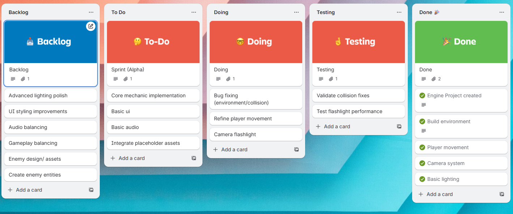

# Project Board Setup Guide
> 

> How to set up your project board to match the coursework requirements.

---

## 1. Create the Board

- Go to your repo → **Projects** tab → **New project**
- Choose **Board** view
- Name it appropriately

---

## 2. Columns

| Column | Purpose |
|--------|---------|
| **Backlog** | All stories not yet in a sprint |
| **Sprint Backlog** | Committed to current sprint |
| **In Progress** | Actively being worked on |
| **In Review** | PR submitted, awaiting review |
| **Done** | Meets Definition of Done |

---

## 3. Custom Fields

| Field | Type | Values |
|-------|------|--------|
| Priority | Single select | Must, Should, Could, Won't |
| Story Points | Number | |
| Sprint | Iteration | Sprint 1, Sprint 2, ... |
| Theme | Single select | <!-- your themes --> |
| Epic | Single select | <!-- your epics --> |

---

## 4. Issue Template

**Title format:** `[US-XXX] Short description`

```markdown
## User Story
As a [role], I want [feature] so that [benefit].

## Acceptance Criteria
- [ ] 
- [ ] 
- [ ] 

## Theme

## Epic

## Story Points

## Priority
```

---

## 5. Labels to Create

- Priority: `must-have`, `should-have`, `could-have`
- Type: `bug`, `enhancement`, `documentation`
- Sprint: `sprint-01`, `sprint-02`, etc.
- <!-- Add your own theme labels -->

---

## 6. Branch Protection

Go to **Settings → Branches → Add rule** for `main`:

- [ ] Require pull request before merging
- [ ] Require approvals (minimum 1)
- [ ] Require status checks to pass (once CI exists)

---

## Board Evidence by Showcase

| Showcase | What the board should show |
|----------|---------------------------|
| **Alpha** | Stories moving through columns |
| **Beta** | Stories in Done with linked PRs |
| **Live** | All core stories in Done |
