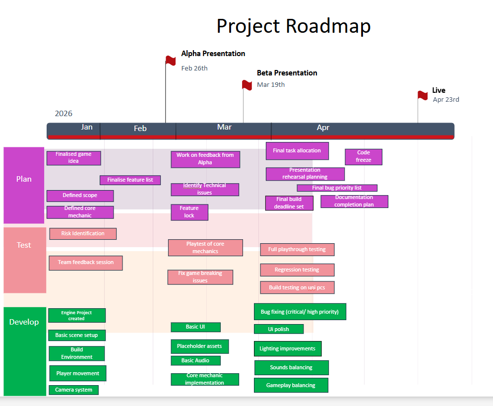

# Product Roadmap

> Maps the project timeline to the remaining coursework showcases: **Alpha → Beta → Live**
>
> 

---

## Overview

```
Alpha ──────► Beta ──────► Live
```

---

## Alpha
**Goal:**  
**Sprints:**  

| Deliverable | Owner | Status |
|-------------|-------|--------|
| | | ☐ |
| | | ☐ |
| | | ☐ |

---

## Beta
**Goal:**  
**Sprints:**  

| Deliverable | Owner | Status |
|-------------|-------|--------|
| | | ☐ |
| | | ☐ |
| | | ☐ |

---

## Live
**Goal:**  
**Sprints:**  

| Deliverable | Owner | Status |
|-------------|-------|--------|
| | | ☐ |
| | | ☐ |
| | | ☐ |

---

## Sprint Calendar

| Sprint | Dates | Showcase |
|--------|-------|----------|
| Sprint 3 | | |
| Sprint 4 | | |
| Sprint 5 | | **Alpha** |
| Sprint 6 | | |
| Sprint 7 | | |
| Sprint 8 | | **Beta** |
| Sprint 9 | | |
| Sprint 10 | | **Live** |
